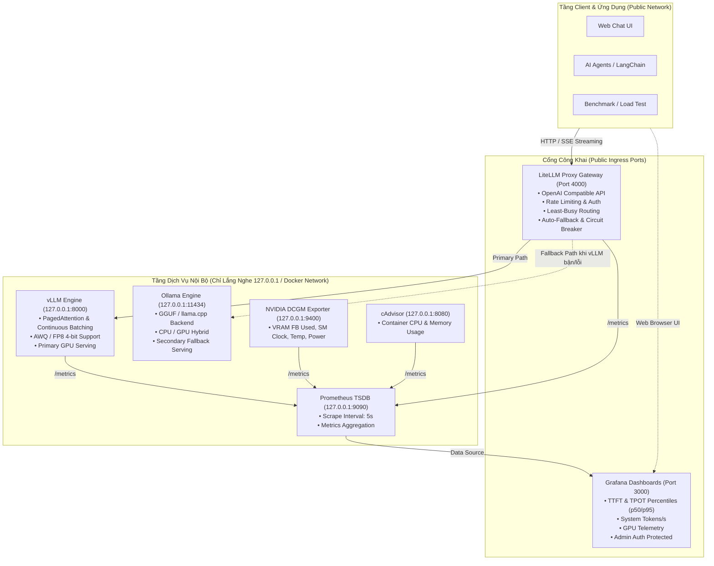

# 🚀 Self-hosted LLM Serving Platform with Docker Compose & Monitoring

[](https://docs.docker.com/compose/)
[-blue)](https://github.com/vllm-project/vllm)
[](https://ollama.ai)
[](https://github.com/BerriAI/litellm)
[](https://prometheus.io/)
[](https://grafana.com/)
[](https://developer.nvidia.com/dcgm)
[](./SECURITY.md)

Hạ tầng tự host mô hình ngôn ngữ lớn (Self-hosted Large Language Model Serving) chuẩn doanh nghiệp, tích hợp cơ chế định tuyến thông minh (Smart Gateway), tự động phục hồi sự cố (High Availability Fallback) và hệ thống giám sát thời gian thực toàn diện các chỉ số vàng (TTFT, TPOT, Throughput, VRAM).

Đồ án được thiết kế với **mục tiêu cốt lõi là định hướng học tập chi tiết, nâng cao tay nghề thực chiến (MLOps & AI Systems Engineering)**, đi kèm với thư mục chuyên đề [`learning/`](./learning/README.md) giải thích tận gốc rễ toán học, phần cứng, lý do kiến trúc và cẩm nang xử lý sự cố.

---

## 🛡️ Cam Kết Bảo Mật & Quyền Riêng Tư (Security & Zero-Leak Policy)
Hệ thống được thiết kế theo tiêu chuẩn **Zero-Trust** nhằm bảo vệ tối đa API Keys và thông tin đăng nhập quản trị:
1. **Tuyệt đối không lưu trữ Secret trong mã nguồn**: Toàn bộ API Key (`LITELLM_MASTER_KEY`), Hugging Face Token (`HF_TOKEN`) và mật khẩu quản trị (`GRAFANA_ADMIN_PASSWORD`) được cô lập trong file `.env` (được `.gitignore` bảo vệ, không bao giờ bị push lên Git).
2. **Cô lập cổng mạng nội bộ (Network Isolation)**: Các engine suy luận thô (`vLLM:8000`, `Ollama:11434`) và hệ thống đo lường (`Prometheus:9090`, `DCGM:9400`, `cAdvisor:8080`) **chỉ lắng nghe tại `127.0.0.1`** (nội bộ máy chủ). Người ngoài Internet bắt buộc phải đi qua LiteLLM Gateway (có xác thực Bearer Token), ngăn chặn hoàn toàn nguy cơ vượt rào chiếm dụng tài nguyên GPU (GPU Hijacking).
3. **Chi tiết chính sách bảo mật**: Xem tại [`SECURITY.md`](./SECURITY.md).

---

## 🏛️ Sơ Đồ Kiến Trúc Hệ Thống (System Architecture)



---

## ✨ Điểm Nổi Bật Của Hệ Thống

1. **Hiệu Năng Suy Luận Vượt Trội**:
   - Tận dụng thuật toán **PagedAttention** và **Continuous Batching** của vLLM, triệt tiêu 96% lãng phí phân mảnh bộ nhớ VRAM, tăng thông lượng phục vụ lên gấp 3x - 5x.
2. **Kiến Trúc Dự Phòng Sẵn Sàng Cao (High Availability)**:
   - Client chỉ cần tương tác qua một cổng duy nhất của **LiteLLM Gateway**. Nếu vLLM gặp sự cố hoặc quá tải, Gateway tự động chuyển request sang **Ollama** mà ứng dụng không bị gián đoạn.
3. **Giám Sát 4 Chỉ Số Vàng (Golden Metrics)**:
   - Tích hợp sẵn 2 Dashboard Grafana trực quan chuyên nghiệp:
     - **LLM Serving Overview**: Đo lường chuẩn xác độ trễ `TTFT` (Time to First Token), `TPOT` (Inter-Token Latency), tốc độ sinh chữ `Tokens/s`, và tỷ lệ bão hòa `KV Cache %`.
     - **GPU Telemetry (DCGM)**: Theo dõi nhiệt độ, công suất điện (Watts), xung nhịp SM, dung lượng VRAM thực tế.
4. **Linh Hoạt Đa Nền Tảng (GPU & CPU Profiles)**:
   - Cung cấp sẵn `docker-compose.yml` (cho máy chủ GPU NVIDIA) và `docker-compose.cpu.yml` (cho máy tính không có GPU hoặc môi trường test nhanh).

---

## 🧭 Danh Mục Cổng & Dịch Vụ (Service Registry)

| Dịch vụ | Cổng Host | Phạm vi truy cập | Chức năng |
| :--- | :--- | :--- | :--- |
| **LiteLLM Gateway** | `4000` | **Public** (Bảo vệ bằng Bearer API Key) | Điểm tiếp nhận request tập trung (OpenAI standard) |
| **Grafana** | `3000` | **Public** (Bảo vệ bằng Admin Auth) | Giao diện trực quan hóa Dashboard giám sát |
| **vLLM Engine** | `8000` | **127.0.0.1 (Nội bộ host)** | Engine suy luận GPU hiệu năng cao |
| **Ollama Engine** | `11434`| **127.0.0.1 (Nội bộ host)** | Engine dự phòng GGUF / CPU |
| **Prometheus** | `9090` | **127.0.0.1 (Nội bộ host)** | Time-Series Database lưu trữ metrics |
| **DCGM Exporter**| `9400` | **127.0.0.1 (Nội bộ host)** | Xuất thông số phần cứng GPU NVIDIA |
| **cAdvisor** | `8080` | **127.0.0.1 (Nội bộ host)** | Đo lường mức sử dụng CPU/RAM của container |

---

## ⚡ Hướng Dẫn Khởi Động Nhanh (Quickstart)

### 1. Yêu Cầu Tiên Quyết
- **Hệ điều hành**: Linux (Ubuntu 22.04+) hoặc Windows 11 với WSL2.
- **Docker**: Docker Engine 24.0+ & Docker Compose v2.
- **GPU (Khuyến nghị)**: Card đồ họa NVIDIA (RTX 3060 12GB trở lên, RTX 3090, 4090, A100) kèm **NVIDIA Container Toolkit**. *(Nếu không có GPU, xem mục chạy CPU bên dưới).*

### 2. Thiết Lập Biến Môi Trường Bảo Mật
Sao chép file cấu hình mẫu sang `.env`:
```bash
cp .env.example .env
```
Mở file `.env` và thiết lập các biến bảo mật của bạn:
- `LITELLM_MASTER_KEY`: Khóa bí mật dùng để gọi API (tạo chuỗi ngẫu nhiên dài tối thiểu 32 ký tự).
- `GRAFANA_ADMIN_PASSWORD`: Mật khẩu quản trị server Grafana của bạn.
- `HF_TOKEN`: (Tùy chọn) Điền token nếu bạn tải các model bị gated của Meta/Google.

### 3. Khởi Động Hệ Thống

#### Cách A: Chạy trên máy có GPU NVIDIA (Mặc định)
```bash
docker compose up -d
```

#### Cách B: Chạy trên máy chỉ có CPU (Laptop / Dev Machine)
```bash
docker compose -f docker-compose.cpu.yml up -d
```

### 4. Tải Model Dự Phòng Vào Ollama
```bash
docker exec -it llm-serving-ollama ollama pull llama3.2:3b
```

### 5. Kiểm Tra Sức Khỏe Toàn Bộ Hệ Thống
Chạy script kiểm tra trạng thái sức khỏe của từng container:
```bash
python scripts/healthcheck.py
```

---

## 🧪 Kiểm Thử & Đo Lường Hiệu Năng (Testing & Benchmarking)

### 1. Gửi Thử Nghiệm Request Suy Luận (Streaming & Non-Streaming)
Script tự động đọc `LITELLM_MASTER_KEY` từ file `.env` của bạn:
```bash
python scripts/test_request.py
```

Hoặc test trực tiếp bằng cURL:
```bash
curl -X POST http://localhost:4000/v1/chat/completions \
  -H "Content-Type: application/json" \
  -H "Authorization: Bearer <YOUR_LITELLM_MASTER_KEY_IN_ENV>" \
  -d '{
    "model": "default-llm",
    "messages": [{"role": "user", "content": "Giải thích ngắn gọn cơ chế KV Cache."}],
    "stream": true
  }'
```

### 2. Chạy Stress-Test Đo Đạc TTFT & Thông Lượng (Benchmark)
Script giả lập người dùng đồng thời, đo các chỉ số p50, p95, p99 của TTFT và tốc độ sinh chữ:
```bash
python scripts/benchmark_llm.py --concurrency 4 --requests 20 --tokens 100
```

---

## 📊 Truy Cập Dashboard Giám Sát (Grafana)
1. Mở trình duyệt tại: `http://localhost:3000`
2. Đăng nhập với tài khoản và mật khẩu bạn đã thiết lập trong file `.env`:
   - **Tài khoản**: `GRAFANA_ADMIN_USER` (mặc định: `admin`)
   - **Mật khẩu**: `GRAFANA_ADMIN_PASSWORD` (đã đặt trong `.env`)
3. Vào mục **Dashboards** $\rightarrow$ Thư mục **LLM Platform**:
   - Xem **LLM Serving Engine - Deep Performance Overview**: Biểu đồ TTFT, TPOT, Queue Size, Tokens/s.
   - Xem **NVIDIA GPU Hardware & VRAM Telemetry**: Biểu đồ VRAM Framebuffer, Nhiệt độ, Xung nhịp SM, Điện năng tiêu thụ.

---

## 🎓 Thư Mục Học Tập Chuyên Sâu (`learning/`)

Hệ thống tài liệu học tập trong thư mục [`learning/`](./learning/README.md) được biên soạn công phu nhằm giúp bạn làm chủ tư duy kiến trúc và kỹ năng vận hành:

| Chuyên mục | Mô tả nội dung học tập |
| :--- | :--- |
| [**01_core_concepts**](./learning/01_core_concepts/) | **Kiến thức cốt lõi**: Prefill vs Decode Phase, bản chất Memory-Bandwidth Bound, giải thuật PagedAttention, công thức toán học tính VRAM chuẩn xác, nguyên lý NVIDIA Container Toolkit và 4 chỉ số vàng. |
| [**02_architectural_evolution**](./learning/02_architectural_evolution/) | **Tiến hóa kiến trúc & Thêm - Xóa - Sửa**: Giải thích cặn kẽ tại sao thêm cờ này, xóa dòng kia qua các version; hướng dẫn đổi model mới; kỹ thuật mở rộng Multi-GPU với Tensor Parallelism vs Data Parallelism. |
| [**03_deep_tradeoffs_and_alternatives**](./learning/03_deep_tradeoffs_and_alternatives/) | **Ma trận đánh đổi & Quyết định công nghệ**: So sánh vLLM vs Ollama vs TGI vs TensorRT-LLM vs SGLang; Khi nào dùng Docker Compose và khi nào bắt buộc lên Kubernetes; Toàn cảnh kỹ thuật nén mô hình AWQ vs GPTQ vs GGUF vs FP8; Lý do chọn LiteLLM Proxy. |
| [**04_production_troubleshooting**](./learning/04_production_troubleshooting/) | **Sổ tay thực chiến Runbook**: Quy trình 4 bước xử lý lỗi CUDA OOM; Điều tra nguyên nhân nghẽn cổ chai (TTFT cao, giật lag, queue đầy); Khắc phục 5 cạm bẫy triển khai thực tế. |

---

## 📁 Cấu Trúc Mã Nguồn (Project Structure)

```text
.
├── README.md                                # Tổng quan đồ án, Architecture Diagram & Quickstart
├── SECURITY.md                              # Chính sách bảo mật, quản lý secrets & cô lập mạng
├── .env.example                             # File mẫu cấu hình biến môi trường (an toàn)
├── .gitignore                               # Bỏ qua models, logs, cache, .env, secrets
├── Makefile                                 # Phím tắt thao tác nhanh: make up, down, logs, test
├── docker-compose.yml                       # Full Stack GPU (vLLM + Ollama + LiteLLM + Monitoring)
├── docker-compose.cpu.yml                   # Stack CPU Fallback (Ollama + LiteLLM + Monitoring)
│
├── config/
│   ├── litellm/
│   │   └── config.yaml                      # Cấu hình định tuyến, fallback, rate-limiting
│   ├── prometheus/
│   │   └── prometheus.yml                   # Cấu hình cào metrics từ vLLM, DCGM, cAdvisor
│   └── grafana/
│       ├── provisioning/
│       │   ├── datasources/
│       │   │   └── datasource.yml           # Tự động nạp Prometheus Data Source
│       │   └── dashboards/
│       │       └── dashboard-provider.yml   # Tự động nạp các Dashboard JSON
│       └── dashboards/
│           ├── llm-serving-overview.json    # Dashboard TTFT, TPOT, Throughput, Queue
│           └── gpu-metrics.json             # Dashboard VRAM, Nhiệt độ, Điện năng GPU
│
├── scripts/
│   ├── healthcheck.py                       # Kiểm tra tính sẵn sàng của toàn bộ stack
│   ├── benchmark_llm.py                     # Giả lập tải đa luồng đo đạc hiệu năng (an toàn token)
│   └── test_request.py                      # Client kiểm thử gọi prompt trực tiếp (an toàn token)
│
└── learning/                                # HỆ THỐNG TÀI LIỆU HỌC TẬP CHUYÊN SÂU
    ├── README.md                            # Lộ trình học (Learning Roadmap)
    ├── 01_core_concepts/                    # Kiến thức nền tảng vật lý & thuật toán
    ├── 02_architectural_evolution/          # Nhật ký tiến hóa & Cẩm nang Thêm-Xóa-Sửa
    ├── 03_deep_tradeoffs_and_alternatives/  # Ma trận so sánh & Đánh đổi kỹ thuật
    └── 04_production_troubleshooting/       # Sổ tay xử lý sự cố thực chiến (Runbook)
```

---

## 📜 Giấy Phép & Tác Quyền
Dự án được xây dựng phục vụ mục đích nghiên cứu, học tập và phát triển kỹ năng MLOps / AI Systems Engineering.
Mọi đóng góp (Pull Request) và phản hồi đều được hoan nghênh!
